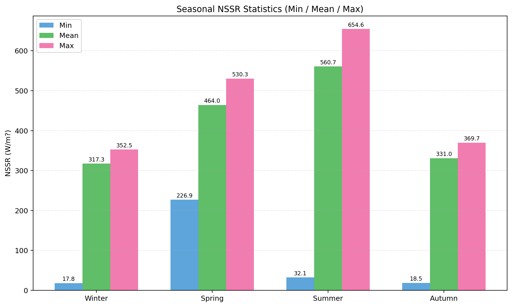
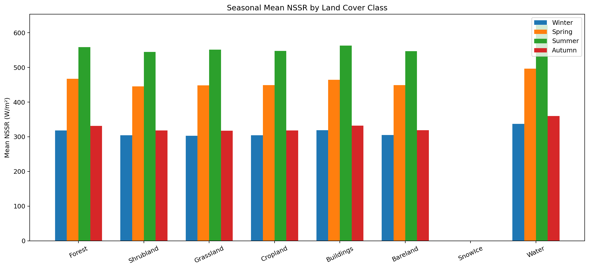
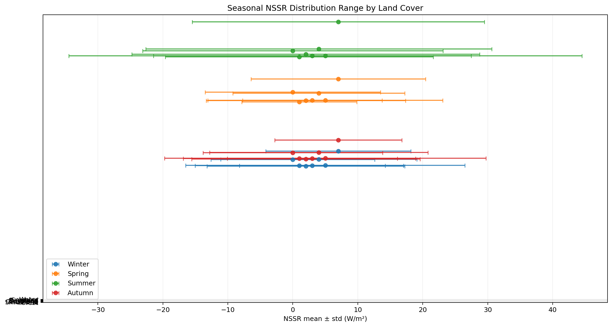
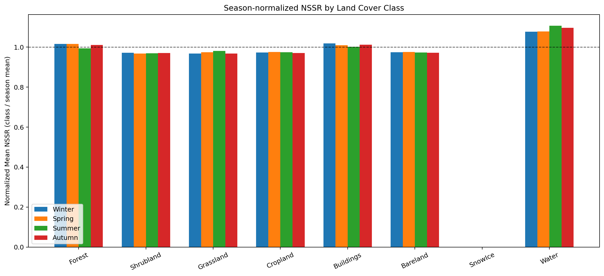
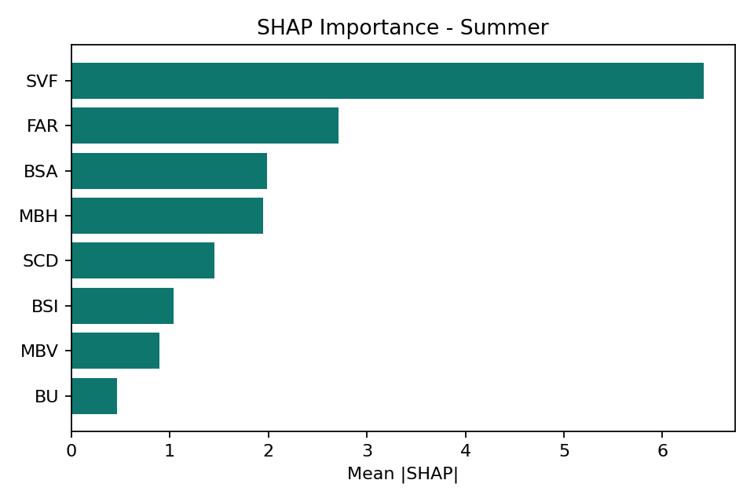
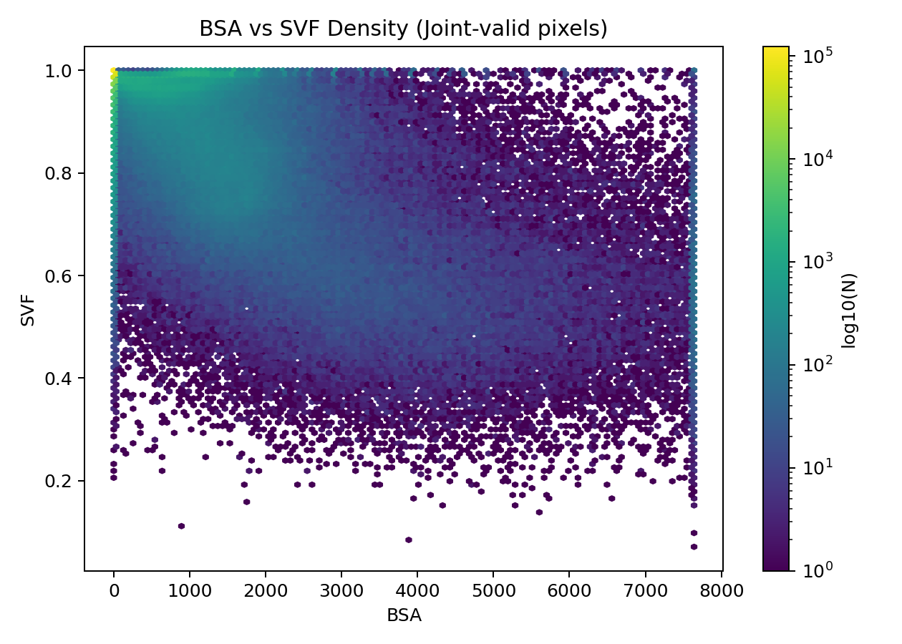

# 二三维城市结构对季节性地表短波净辐射的影响

## 1. 项目目标
本项目以北京研究区（方形研究区）为对象，分析：
- 二维地表类型差异如何影响季节性 `NSSR`；
- 三维城市形态参数如何调制 `NSSR` 空间分布；
- 在四季解耦条件下，主导因子及其贡献方向（SHAP）。

当前统一物理定义：

```text
NSSR = DSSR * (1 - Albedo)
```

> 说明：本项目研究的是 **地表短波净辐射（NSSR）**，不包含长波项。

---

## 2. 数据来源与处理

### 2.1 外部原始数据（未上传）
以下数据体量较大，不随仓库提交：
- `input/Albedo`（Landsat 反照率产品）
- `input/era52`（优化版 ERA5 像元太阳几何与 DSSR）

请将原始数据按上述路径放置后运行脚本。

### 2.2 Albedo 获取方法（GEE）
Albedo 由 Landsat 8/9 Collection 2 L2 地表反射率计算：
- 波段缩放：`SR * 0.0000275 - 0.2`
- 使用 Liang(2001) 经验公式：

```text
α = 0.356*B2 + 0.130*B4 + 0.373*B5 + 0.085*B6 + 0.072*B7 - 0.0018
```

并对时段影像采用 `median()` 进行云影响抑制。

### 2.3 ERA5 获取方法（GEE）
ERA5-Land 小时数据按目标时刻提取，`DSSR` 由相邻小时累计量差分并转为 `W/m²`：

```text
DSSR_Wm2 = max(SSR(t) - SSR(t-1h), 0) / 3600
```

同批次导出像元级太阳天顶角/方位角与近地气象变量（优化后数据放在 `era52`）。

### 2.4 已上传仓库的数据
- `data/nssr`：四季反演后的 NSSR 栅格
- `data/landcover/Beijing_ESA_LC_2023_30m.tif`：地表覆盖
- `results/*`：二维统计、XGBoost 和 SHAP 结果

---

## 3. 项目结构
- `scripts/fanyan.py`：四季 NSSR 反演
- `scripts/diwufenlei.py`：NSSR × Land Cover 二维定量评估
- `scripts/build_3dmorph.py`：30m 三维形态因子构建（含 SVF 合并）
- `scripts/create_training_samples_output2.py`：训练样本生成
- `scripts/train_samples_seasonal_output2.py`：四季解耦训练与评估

- `results/diwufenlei`：地物分类统计表与图
- `results/xgboost_output2`：训练评估、特征重要性、SHAP
- `results/figures`：核心展示图

---

## 4. 关键结果图

### 4.1 四季 NSSR 空间组图


### 4.2 四季 NSSR 统计图（最大/最小/均值）


### 4.3 地物分类季节均值


### 4.4 地物分类分布范围


### 4.5 地物分类归一化对比


### 4.6 SHAP 贡献（示例：夏季）


### 4.7 形态关系检查（BSA vs SVF）


---

## 5. 方法流程
1. 使用 Albedo + `era52` 反演四季 NSSR（`fanyan.py`）
2. 使用 Land Cover 做二维定量统计（`diwufenlei.py`）
3. 构建三维形态因子并与 NSSR 配准采样（`build_3dmorph.py` + `create_training_samples_output2.py`）
4. 四季解耦训练 + SHAP 解释（`train_samples_seasonal_output2.py`）

---

## 6. 复现步骤
1. 将外部原始数据放回：
   - `input/Albedo`
   - `input/era52`
2. 运行：

```bash
python scripts/fanyan.py
python scripts/diwufenlei.py
python scripts/create_training_samples_output2.py
python scripts/train_samples_seasonal_output2.py
```

---

## 7. 当前版本备注
- 旧版 `input/ERA5` 不再使用；后续统一使用 `era52`。
- 若需完整过程说明，见 `SUMMARY.md`。
